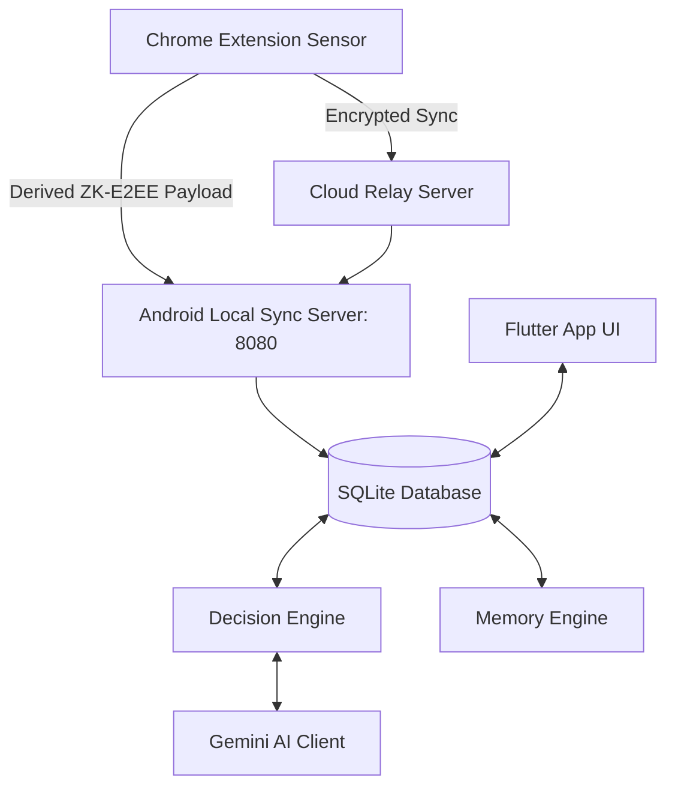

# AKRAMYG: AI-Powered Local-First Execution Assistant

AKRAMYG is a privacy-first, context-aware execution assistant that helps you stay focused, capture tasks automatically, and redirect procrastination moments. It consists of a **local-first Android companion app** (Flutter) and a **Chrome Extension sensor** (TypeScript) connected via a secure, end-to-end encrypted local sync pipeline.

---

## 🏗 System Architecture

AKRAMYG operates on a client-sensor architecture designed to keep your personal data entirely under your control.



---

## 🤖 Core Subsystems & Features

### 1. Android Companion Application
A Flutter application designed with a **Warm Beige & Burnt Sienna** Material 3 palette:
*   **⚡ NOW (Dashboard):** One-tap focus session tracker with real-time session timer and smart recommendations.
*   **📋 TASKS (Task Manager):** Comprehensive task lists with priority scoring and checklists automatically generated by the AI model.
*   **💬 CONVO (Chat Companion):** Chat companion that parses natural-language prompts to propose tasks, save habits, or generate execution plans.
*   **📈 INSIGHTS:** Habit-tracking dashboards surfacing patterns in focus and avoidance over time.
*   **⚙️ SETTINGS:** Secure Gemini API key configuration and context sensor toggles.

### 2. Chrome Extension (Execution Sensor)
A background observer that tracks web context and captures events:
*   **📅 Deadline Scraper:** Automatically detects calendar dates, Canvas assignments, and GitHub milestones.
*   **🎯 Distraction Monitor & Cognitive Interception:** When a focus session is active on your phone, visiting distraction websites (e.g. YouTube, Reddit) triggers the Cognitive Interception interstitial page.
*   **🧠 Micro-Productive Interstitial:** Replaces raw blockers with a Material 3 nudge showing your current active task and its next pending subtask. Features:
    *   **Done Option:** Check off the subtask directly from the browser to sync and update the database.
    *   **Focus Option:** Close the tab instantly to return to your work.
    *   **Bypass Link:** Pause the interception for that specific tab/session if you must access the page.

### 3. ZK-E2EE Sync Pipeline
*   **Zero-Knowledge End-to-End Encryption:** Synced data is encrypted client-side using AES-GCM (256-bit).
*   **Derived Channels:** Channels use PBKDF2-derived keys so no raw passwords pass over the network or relays.
*   **Offline First:** The system defaults to local Wi-Fi sync (`http://<android-ip>:8080`).

---

## 🛠 Setup & Installation

### 1. Android App
1. Ensure Flutter is installed.
2. Run dependency resolution:
   ```bash
   cd android_app
   flutter pub get
   ```
3. Compile the release production APK:
   ```bash
   flutter build apk --release
   ```
   The output is saved to: `build/app/outputs/flutter-apk/app-release.apk`

### 2. Chrome Extension
1. Install dependencies:
   ```bash
   cd chrome_extension
   npm install
   ```
2. Build the extension bundle:
   ```bash
   npm run build
   ```
3. Sideload the extension:
   - Open Google Chrome and navigate to `chrome://extensions/`
   - Enable **Developer Mode** (top right)
   - Click **Load unpacked** (top left)
   - Select the `chrome_extension/dist` folder
