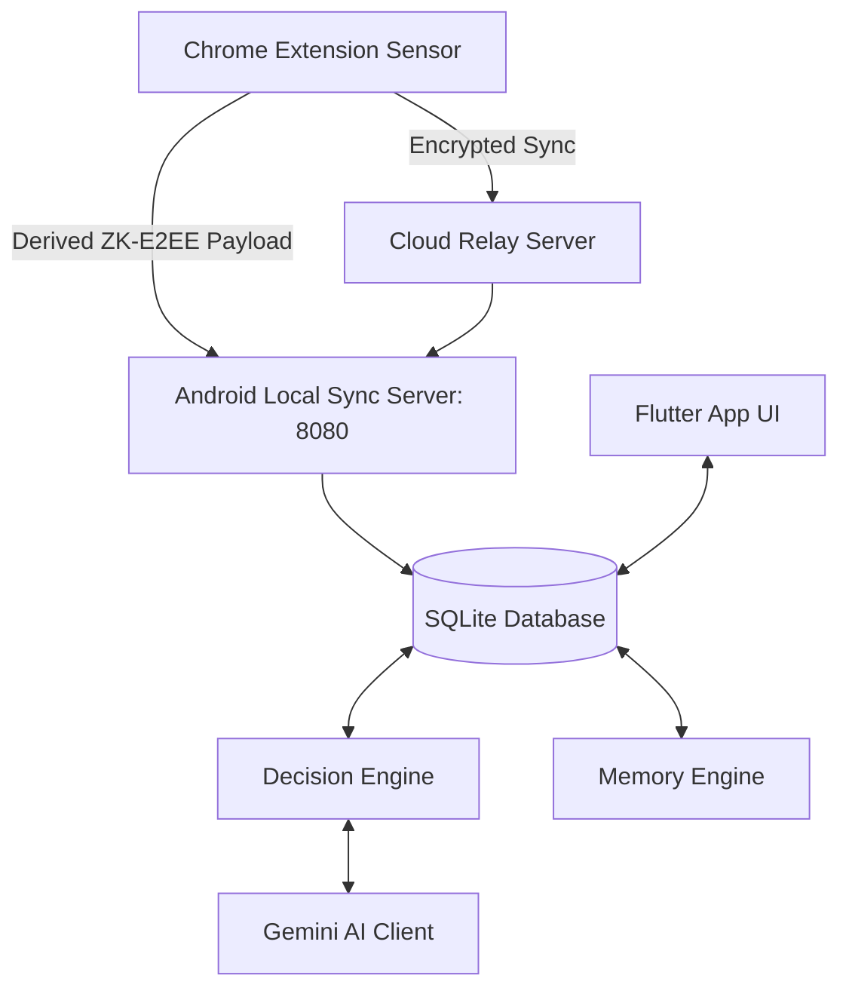

# AKRAMYG: AI-Powered Local-First Execution Assistant

AKRAMYG is a privacy-first, context-aware execution assistant that helps you stay focused, capture tasks automatically, and track deadlines. It consists of a **local-first Android application** and a **Chrome Extension sensor** connected via a secure, end-to-end encrypted local sync pipeline.

---

## 🏗 System Architecture

AKRAMYG operates on a client-sensor architecture designed to keep your personal data entirely under your control.



---

## 🤖 Core Subsystems & Features

### 1. Android Companion Application
A beautiful, Material 3 application designed with a **Warm Beige & Burnt Sienna** palette.

*   **⚡ NOW (Dashboard):** 
    *   One-tap focus session tracker.
    *   Real-time session timer.
    *   Smart recommendations for what to focus on next.
*   **📋 TASKS (Task Manager):**
    *   Comprehensive task lists with priority scoring (High, Medium, Low) calculated by the Decision Engine.
    *   Interactive subtask execution checklists automatically generated by the AI model.
    *   Visual progress tracking indicators.
    *   Swipe-to-complete and direct list checkbox quick-actions.
    *   Reference links attached directly to tasks.
*   **💬 CONVO (Chat Companion):**
    *   Interactive chat companion with pre-loaded quick-prompt chips to guide onboarding.
    *   Zero-configuration warning banners.
    *   Thinking indicator.
    *   Automatically parses messages to propose new tasks, save long-term habits, or generate detailed execution plans.
*   **📈 INSIGHTS:**
    *   Displays productivity metrics, delay habits, and focus session history.
*   **⚙️ SETTINGS:**
    *   **AI Configuration:** Securely configure your Gemini API Key. Features auto-healing for deprecated model strings and an instant network validation probe.
    *   **Context Sensors:** Toggle data providers (Foreground App Monitor, Battery/Power state, Network connectivity).

---

### 2. Chrome Extension (Execution Sensor)
A lightweight background observer that feeds data into the assistant:
*   **📅 Deadline Scraper:** Automatically detects calendar dates and assignment deadlines on LMS platforms (like Canvas), GitHub milestones, or raw text.
*   **🎯 Distraction Monitor:** When a focus session is active on your phone, visiting distraction websites (e.g. social media) triggers the Decision Engine to send a focus nudge notification.
*   **🔗 Page & Highlight Attachment:** Right-click or open the popup to attach page context or selected text directly to a task on your phone.

---

### 3. ZK-E2EE Sync Pipeline
*   **Zero-Knowledge End-to-End Encryption:** All data synced between your browser and Android app is encrypted using AES-GCM (256-bit).
*   **Derived Channels:** Keys are generated securely using PBKDF2 with shared pairing keys so no plain text passes over the local network or the Cloud Relay.
*   **Offline First:** The system runs locally over your Wi-Fi (`http://<android-ip>:8080`).

---

## 🛠 Setup & Installation

### 1. Android App
1. Ensure Flutter is installed (`sdk: '>=3.0.0 <4.0.0'`).
2. Run `flutter pub get` in `android_app/`.
3. Start the application:
   ```bash
   flutter run
   ```

### 2. Chrome Extension
1. Open Google Chrome.
2. Go to `chrome://extensions/` and toggle **Developer Mode** to **ON** (top right).
3. Click **Load unpacked** (top left).
4. Select the directory:
   `chrome_extension/dist`

---

## 🧠 AI Performance Optimization
AKRAMYG uses a **Dual-Model Architecture** to ensure fast responses and high reliability:
1.  **JSON Structured Model:** Configured with `responseMimeType: 'application/json'` and `temperature: 0.2` for deterministic parsing, duration estimation, and plan creation.
2.  **Text Model:** Configured with `temperature: 0.7` for creative explanations, conversation replies, and summary generation.
3.  **Exponential Backoff Retries:** Automatically handles rate limits (429 errors) and transient server issues.
