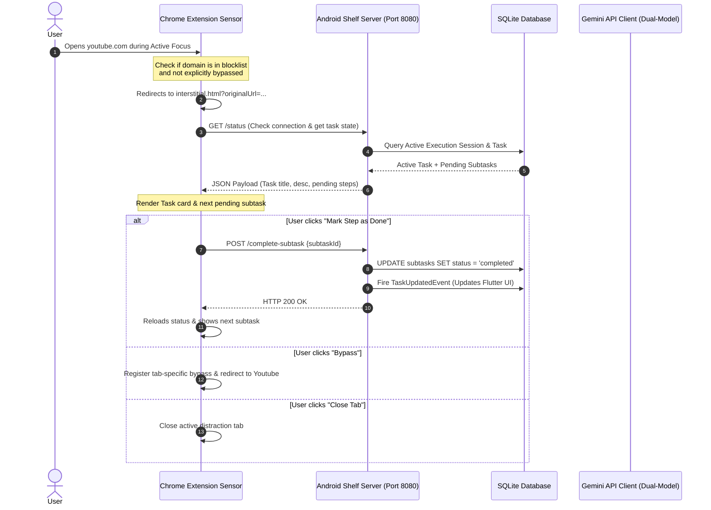

# AKRAMYG: AI-Powered Local-First Cognitive Interception System

AKRAMYG is a privacy-first, context-aware execution assistant built to intercept digital avoidance (akrasia) in the moment it happens. By linking a **local-first Android companion app** (Flutter) with a **Chrome Extension sensor** (TypeScript) over a zero-knowledge end-to-end encrypted sync pipeline, it detects when you avoid focus tasks by opening distraction sites, and redirects you with concrete, micro-productive next steps instead of a blunt block wall.

---

## 🏗 System Architecture & Data Flow

AKRAMYG operates on a client-sensor architecture designed to keep your personal data entirely under your control.



---

## 💾 Core Subsystems

### 1. Android Companion Application (Flutter/Dart)
Designed with a support-focused Warm Beige and Burnt Sienna Material 3 palette:
*   **⚡ NOW Dashboard:** Start/stop focus sessions. Real-time timer calculates session durations and records interruptions.
*   **📋 Task Board:** Prioritizes tasks and generates AI-parsed subtask checklists. Supports swipe-to-complete and manual task entry.
*   **💬 Convo Chat:** Conversational interface matching natural language inputs to task creations, long-term habit tracking, and execution planning.
*   **📈 Insights Screen:** Visualizes completed task counts, focus session durations, and lists behavior engine insights.
*   **⚙️ Settings Panel:** Reconfigures Gemini API keys, validates model availability, and controls network, battery, and background app permissions.

### 2. Chrome Extension (TypeScript/Esbuild)
Acts as the browser environment sensor:
*   **📅 Scrapers:** Automatically parses Canvas student assignments, GitHub milestones, and standard HTML dates using specific selectors and regex templates.
*   **🎯 Distraction Interceptor:** Observes tab updates. If you visit a domain in your blocklist while a phone focus session is running:
    1. Checks if you have already bypassed the block on this specific tab.
    2. Packages the original URL and redirects the tab to `interstitial.html`.
    3. Fetches the active task and next pending subtask from the phone.
    4. Shows options to complete the subtask, close the tab, or temporarily bypass the block.
*   **⚙️ Sync Engine:** Checks connection status periodically, displays connection logs, and manages custom blocklist domains.

### 3. ZK-E2EE Sync Pipeline
*   **Zero-Knowledge Encryption:** Encrypts local-first sync payloads with client-side AES-GCM (256-bit).
*   **Key Derivation:** Generates shared pairing credentials using PBKDF2. No plain-text credentials or task details ever hit the network or the optional Cloud Relay.
*   **Fallback Relay:** Uses a secure mailbox relay to sync client states when devices are on different networks.

---

## 🤖 Dual-Model Gemini AI Orchestration
AKRAMYG uses a two-pronged configuration of the Google Gemini API:
1.  **Deterministic Structured Model (`temperature: 0.2`)**:
    *   Configured with `responseMimeType: 'application/json'`.
    *   Used for structured task parsing, milestone date estimation, and generating strict checklists.
2.  **Conversational Text Model (`temperature: 0.7`)**:
    *   Used for onboarding chats, explanations, and summarizing web pages.

---

## 🛠 Compilation & Installation

### 1. Chrome Extension Compilation
To bundle the extension and package it for Chrome:
1. Install development dependencies:
   ```bash
   cd chrome_extension
   npm install
   ```
2. Build the extension bundle (compiles TypeScript with Esbuild and copies assets to `/dist`):
   ```bash
   npm run build
   ```
3. Load the extension in Chrome:
   - Navigate to `chrome://extensions/`
   - Enable **Developer Mode** in the top right.
   - Click **Load unpacked** in the top left.
   - Select the `chrome_extension/dist` folder.
4. Compress the package:
   To create the release archive:
   ```powershell
   Compress-Archive -Path chrome_extension/dist/* -DestinationPath akramyg-chrome-extension-v1.0.0.zip -Force
   ```

### 2. Android App Build
To build and run the companion app:
1. Install Flutter (SDK version `>=3.0.0 <4.0.0` is required).
2. Resolve dependencies:
   ```bash
   cd android_app
   flutter pub get
   ```
3. Compile the release production APK:
   ```bash
   flutter build apk --release
   ```
   The built APK will be generated at:
   `android_app/build/app/outputs/flutter-apk/app-release.apk`
